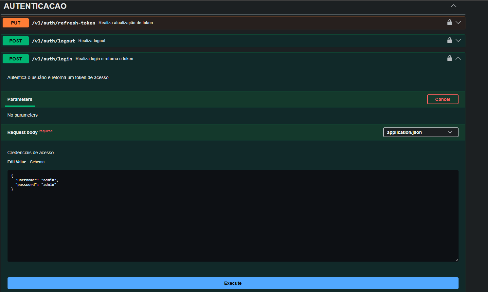

Nome do participante: Rafael Ribeiro Estrela

N° Inscrição : 16428

Documentação:

# 🛠️ API – Desafio Seplag MT (Desenvolvedor Java Backend)

Este repositório contém a implementação da API desenvolvida para o desafio técnico do ** PROCESSO SELETIVO CONJUNTO Nº 001/2026/SEPLAG/SEFAZ/SEDUC/SESP/PJC/PMMT/CBMMT/DETRAN/POLITEC/SEJUS/SEMA/SEAF/SINFRA/SECITECI/PGE/MTPREV** para o cargo de **Engenheiro da Computação/SÊNIOR**.

---

## 🚀 Tecnologias Utilizadas

- **Java 21**
- **Spring Framework** (Spring Boot, Spring Data, Spring Security)
- **PostgreSQL** – Banco de dados relacional
- **MinIO** – Armazenamento de arquivos (compatível com S3)
- **Redis** – Banco de dados NoSQL
- **Docker & Docker Compose**
- Arquitetura **MVC**, com aplicação de **padrões de projeto** para melhor organização e manutenção

---

## 🐳 Preparando o Ambiente com Docker - SEGUIR COM ATENÇÃO AS INSTRUÇÕES ABAIXO PARA QUE A APLICAÇÃO SEJA EXECUTADA COM SUCESSO !!!!

Antes de subir os containers da aplicação, recomenda-se **limpar o ambiente Docker** para evitar conflitos com containers, volumes e redes antigas.

### 🔄 Limpeza do Docker

```bash
# Parar todos os containers em execução
docker stop $(docker ps -q)

# Remover todos os containers
docker rm $(docker ps -a -q)

# Remover todas as imagens
docker rmi -f $(docker images -q)

# Remover todos os volumes
docker volume rm $(docker volume ls -q)

# Remover todas as redes
docker network rm $(docker network ls -q)

# Limpeza completa e segura
docker system prune -a --volumes -f
```

---

## ▶️ Executando a Aplicação

### 1. Clone o repositório

```bash
git clone https://github.com/RafaelRibeiroEstrela/rafaelribeiroestrela056161.git
cd rafaelribeiroestrela056161
cd processo-seletivo-api
```

### 2. Suba os containers com Docker Compose

Na pasta principal do projeto, execute o comando:

```bash
docker compose -f "docker-compose.yml" up -d --build
```

O sistema irá subir os seguintes serviços:

- API Java Spring Boot
- Banco de dados PostgreSQL
- Servidor MinIO (acessível via browser)
- Banco de dados Redis

---

## 🧪 Testando a API

A API expõe endpoints RESTful documentados via Swagger (ou Postman, se aplicável).

- Acesse a documentação:

```
http://localhost:26000/swagger-ui.html
```

- Utilize ferramentas como **Postman** ou **curl** para testar os endpoints.

---

## Itens atendidos:

A. Arquitetura e Estrutura

A1 - Organização e camadas - Projeto estruturado em camadas (controller, service, repository, model). ✅

    O projeto foi desenvolvido utilizando arquitetura em camadas, sendo que a camada mais acima se comunica com a camada mais abaixo, utilizando a classe de dominio(model).

    


A2 - Versionamento e documentação - Endpoints versionados e descritos via Swagger/OpenAPI. ✅
A3 - Migrations e README - Uso de Flyway e documentação com instruções de execução. ✅

    Os arquivos do banco de dados versionados estão no diretorio db.migrations conforme imagem abaixo.

    

    Ao subir a aplicação para o docker, o banco de dados será criado e estruturado conforme esses arquivos automaticamente.

B. Funcionalidades Técnicas

B1 - CRUD e endpoints REST - Implementação funcional dos verbos POST, PUT, GET, DELETE. - ✅
B2 - Paginação e Filtros - Consultas com ordenação e filtros de nome. - ✅
B3 - Upload/MinIO - Upload de arquivos e geração de presigned URLs. - ✅
B4 - Autenticação JWT - Implementação com expiração e renovação de token. - ✅

    Caso queira testar pelo Swagger, utilize o endpoint de login, com o username e password predefinidos

    

    Em seguida, coloque o token gerado no Authorize do Swagger

    

    Isso fara com que todas as requisições utilizem o token inserido.

    Não se esqueça que o token irá expirar após 5 minutos.

B5 - Segurança (CORS e Rate Limit) - Bloqueio de domínios externos e limite de requisições. - ✅
B6 - WebSocket e Sincronização (Sênior) - Notificações em tempo real e sincronização de regionais. - ✅

    Para sincronizar com o websocket, utilizar os parametros:
        WS_URL = "ws://localhost:26000/ws"
        TOPIC = "/topic/albuns/novos"

    Tem um client pronto em python caso queira testar. Está na pasta client-websocket

B7 - Health Checks / Liveness - Endpoints de verificação do serviço. - ✅

C. Boas Práticas e Qualidade

C1 - Clean Code e legibilidade - Código limpo, nomeações adequadas e separação de responsabilidades. - ✅

    Para essa finalidade foi utilizado conceitos do livro Código Limpo: Habilidades Práticas do Agile Software do autor Robert C. Martin

C2 - Testes unitários e integração - Cobertura mínima de testes nos módulos principais. - ✅

    Foi criado testes unitários das classes de negócio, envolvendo Album, Artista e Regionais.
C3 - Commits e versionamento - Histórico coerente e incremental. - ✅
C4 - README técnico e justificativas - Clareza nas decisões e priorização. - ✅

    Implementar as classes de negócio foram priorizadas, pois a implementação do dominio do negócio ou do problema a ser resolvedo é que cerne o desenvolvimento de um software.
    Desenvolvimento de funcionalidades "tecnicas" como segurança, armazenamento, configurações foram desenvolvidas em um segundo momento.

C5 - Escalabilidade e manutenção - Soluções preparadas para evolução. - ✅

    A aplicação está preparada para rodar em arquiteturas mais robustas como microsserviços, e em infraestruturas mais complexas como docker-swarm, openshift ou kubernetes.
    O redis é uma tecnologia excencial para a escalabilidade, uma vez que trás benefícios em uma arquitetura de multiplas instancias, principalmente na parte de segurança e rate-limit.
    A manutenção é facilitada, uma vez que o código está organizado em camadas, e em classes bem definidas, utilizando conceitos de SOLID e padrões de projeto.

## ✅ Status

> ✅ Projeto concluído com sucesso  
> Pronto para avaliação técnica
